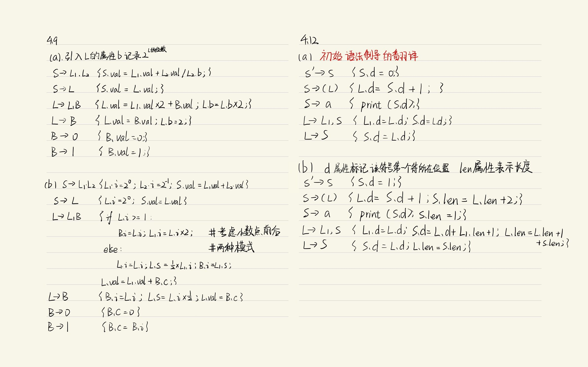
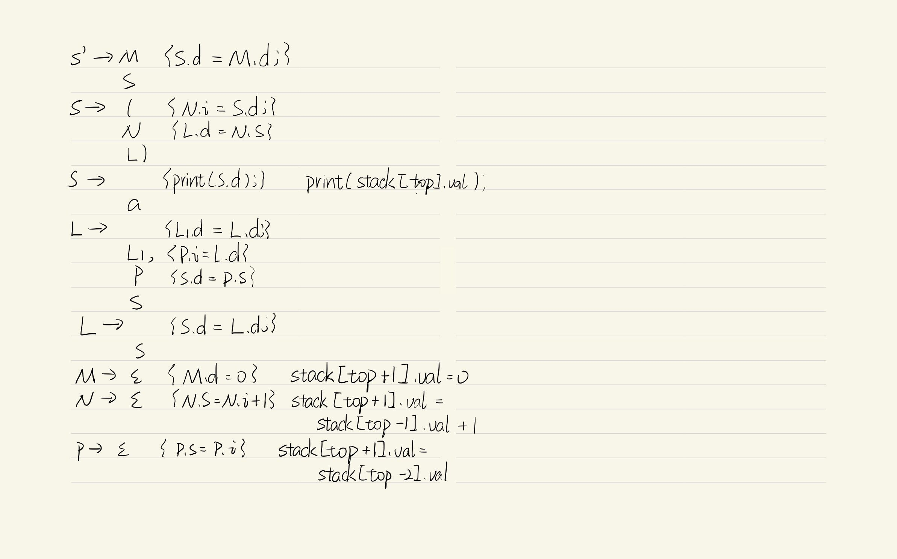
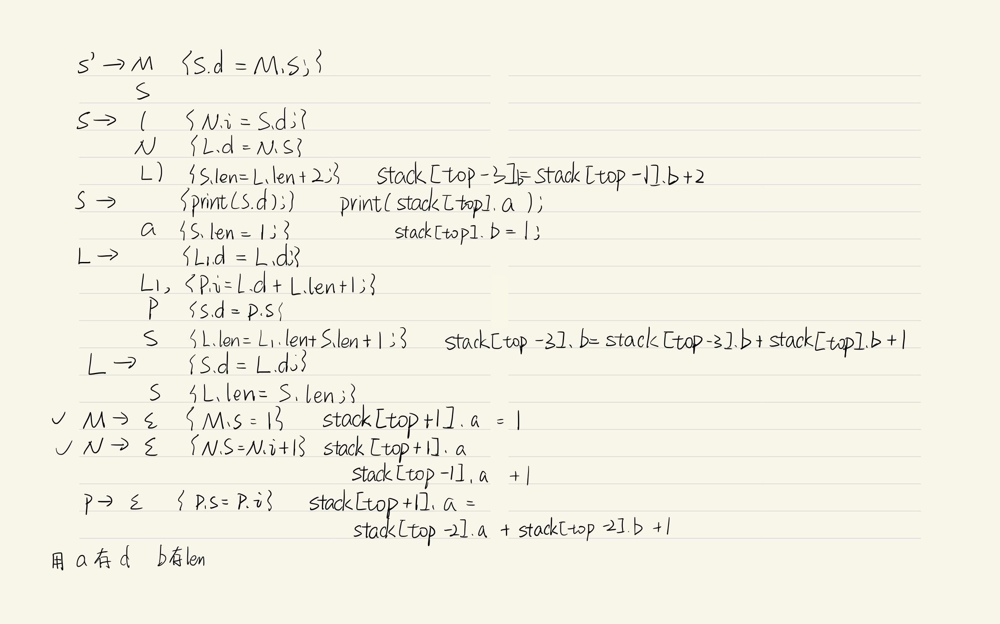
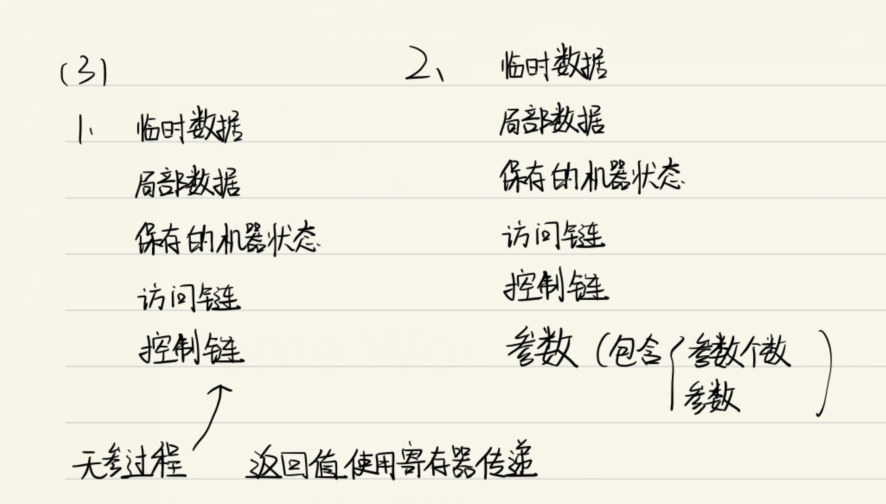
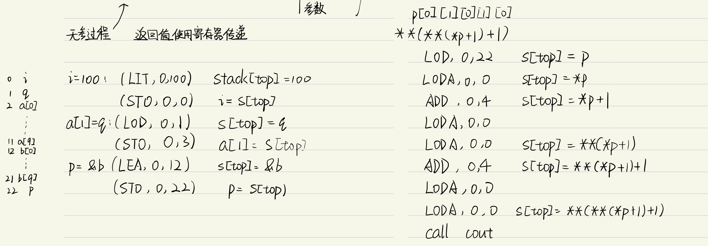

### 第一、二题：







### 第三题：



```asm
case LEA: //指令格式(LEA,l,a) //其中“取地址”指令 LEA 用来获取名字变量在“运行时栈-stack”上“地址偏移”
    stack[++top] = base(stack, b, i.l) + i.a;
    break;
case LODA: //指令格式(LODA,0,0) //而“间接读”指令 LODA 则表示以当前栈顶单元的内容为“地址偏移”来读
    //取相应单元的值，并将该值存储到原先的栈顶单元中。
    stack[top] = stack[stack[top]];
    break;
case STOA: //(STOA,0,0) //而“间接写”指令 STOA 则将位
    //于栈顶单元的内容，存入到次栈顶单元内容所代表的栈单元里，然后弹出栈顶和次栈顶
    stack[stack[top-1]] = stack[top];
    top-=2;
    break;
```

1. a: array(10,pointer(int))
   p: pointer(array(10,array(10,pointer(int))))
2. 分别占用1,1,10,10,1个int大小空间，共23个，偏移量为0，1，2，12，22
3. $(*p)[1][0][1][0] \\ p[0][1][0][1][0]$

​	4. 

5.  r: LOD,0,3 

   r: LOD,0,3

   *r: LOD,0,3

   ​	LODA,0,0

### runtime练习：

#### 一

1. 输出:36313032 2016
2. 汇编代码如下 

```asm
    .section .rodata
.LC0:
    .ascii "%x %s\n"
    .text
.globl  main
    .type main,@function
main:
    pushl   %ebp
    movl    %esp, %ebp
    subl    $40, %esp
    andl    $-16, %esp #此行在内下三行应该是负责对其用的
    movl    $0, %eax
    subl    %eax, %esp
    movb    $50, -24(%ebp)

    movb    $48, -23(%ebp)
    movb    $49, -22(%ebp)
    movb    $54, -21(%ebp)
    movb    $0, -20(%ebp)
    leal    -24(%ebp), %eax

    movl    %eax, -28(%ebp)

    subl    $-4,
    pushl   -28(%ebp)
    pushl   -24(%ebp)
    

    pushl   $.LC0
    call    printf
    addq    $16, %esp
    movl    $0, %eax
    leave
    ret
```

#### 二

汇编代码：
1. N=2:
```asm
    .file "test1.c"
    .text
.globl f
    .type f,@function
f:
    pushl %ebp
    movl %esp, %ebp
    movl $100, 8(%ebp)
    movl $16 , 12(%ebp)
    movb $65 , 17(%ebp) 
    movl 20(%ebp), %eax
    pushl   12(%eax)
    pushl   8(%eax)
    pushl   4(%eax)
    pushl   (%eax)
    call f
    addl $16, %esp
    leave
    ret
//当 N=2 时，生成的汇编代码片段。
```

2. N=11
```asm
    file "test1.c"
    .text
.globl f
    .type f,@function
f:
    pushl %ebp
    movl %esp, %ebp
    pushl %edi
    pushl %esi
    movl $100, 8(%ebp)
    movl $24, 12(%ebp)
    movb $65, 17(%ebp)
    subl $8, %esp
    movl 28(%ebp), %eax
    subl $24, %esp
    movl %esp, %edi
    movl %eax, %esi
    cld
    movl $24, %eax #确认大小
    movl %eax, %ecx
    rep
    movsl
    call f
    addl $32, %esp
    leal -8(%ebp), %esp
    popl %esi
    popl %edi
    leave
    ret
```

3. addl 作用是清除给函数传参的空间，先前这16个空间正好对应给函数传递的参数，函数调用时产生的局部空间会自己删除，所以只需考虑删除传参分配的空间

leal的作用是移动esp到合适的位置，恢复函数调用的时候借用的edi和esi寄存器，恢复现场。

4. 编译器根据结构体大小，将结构体中的元素依次pushl到栈中，然后调用函数

#### 三

1. line元素值为1,2,3,4,5,6,7,8,9,10

```asm
    .file "p.c"
    .text
.globl main
    .type main,@function
main:
    pushl %ebp
    movl %esp, %ebp
    subl $72, %esp
    andl $-16, %esp
    movl $0, %eax
    subl %eax, %esp
    leal -56(%ebp), %eax #留给数组的
    movl %eax, -64(%ebp) #指针p
    movl $0, -60(%ebp)   #i
.L2:
    cmpl $9,-56(%ebp)
    jle .L5 #继续循环
    jmp .L3
.L5:
    movl -64(%ebp), %edx
    movl -60(%ebp), %eax
    movl %eax, (%edx)
    subl $12, %esp
    leal -64(%ebp), %eax
    pushl %eax
    call g
    add $16,%esp
    leal -60(%ebp), %eax
    incl (%eax)
    jmp .L2
.L3:
    movl $0, %eax
    leave
    ret
.globl g
    .type g,@function
g:
    pushl %ebp
    movl %esp, %ebp
    movl 8(%ebp), %eax #传参的位置
    movl (%eax), %eax
    addl $1,(%eax) #(**p)++
    movl 8(%ebp), %eax
    addl $1,(%eax)
    leave
    ret
```

#### 四

```asm
main:
    pushl %ebp
    movl %esp,%ebp
    subl $24, %esp
    andl $-16, %esp
    movl $0, %eax
    subl %eax, %esp
    movl $0, -20(%ebp)
    movl $0, -16(%ebp)
    movl $1, -12(%ebp)
    movl $2, -12(%ebp)
    movl $3, -8(%ebp)
    movl $0, %eax
    leave
    ret
```
分配变量时考虑作用域，离开作用域后该变量空间即被废弃，可以被分配新值

#### 五

```asm
.LC0:
    .long 0
    .long 1
    .long 2
    .long 3
    .long 4
    .long 5
.LC1:
    .string "%d\n"
    .text
.globl main
    .type main,@function
main:
    pushl %ebp
    movl %esp, %ebp
    pushl %edi
    pushl %esi
    subl $48, %esp
    andl $-16, %esp
    movl $0, %eax
    subl %eax, %esp
    leal -40(%ebp), %edi
    movl $.LC0, %esi
    cld
    movl $6, %eax
    movl %eax, %ecx
    rep
    movsl
    movl $6, -44(%ebp)
    movl $7, -48(%ebp)
    #数据初始化完成
    leal -40(%ebp), %eax
    addl $24, %eax
    movl %eax, -52(%ebp)
    subl $8, %esp
    movl -52(%ebp), %eax
    subl $4 , %eax
    pushl %eax
    pushl $.LC1
    call printf
    addl $16, %esp # -8 还有两个pushl
    movl $0, %eax
    leal -8(%ebp), %esp
    popl %esi
    popl %edi
    leave
    ret
```

波浪线处：分配空间，初始化数组，使用的是题目二中提到的rep和movsl 数据传输指令。数组元素的初值一开始在.LC0 大概率是静态数据区，需要拷贝到程序运行的地方。

#### 六：

结果为11。local嵌套深度最大的定义是在f(11,local)函数里，所以之后的local会返回11。

level=10为止，arg（）的访问链均指向上一层，之后都指向level=10的一层

