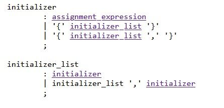

## 修改后的PL/0语言文本

$$
digit&      &->&   (0-9)\\
number&     &->&   (digit)^+\\
letter&      &->&   [A-Za-z]\\
identifier&       &->&   letter[(letter|digit)]^*\\
relop&  &->&   < | > | <> | <= | >= |  = \\
op&         &->&   + | - | \times | / | , | . | ; | ( | ) | = | &\\
word&              &->&      begin | const | call | do | end | if |else | odd |\\
&&&procedure |while | for |var | then|setjmp|longjmp
$$

$$
\begin{align}
program ::=&\\
			&body.\\
body ::=&\\
      	&“const” { identifier “=”number“,”}<identifier “=” number “;”>\\
            &|  “var”{identifier[ {“[”number“]”}],}<identifier[{“[”number“]”}]“;”>\\
       &| “procedure” “;” body “;”\\
       &| stmt_mul\\
stmt_mul ::=&\\
       &{stmt “;”}
stmt ::=&\\
        &identifier[{“[”number“]”}] “:=” expression、、
        &| “call” identifier\\
        &| “begin” stmt_mul “end”\\
        &| “if” <condition> then stmt “else” stmt\\
        &| “while” <condition> “do” stmt\\
		&|“for”“(“ ((expression“;”)|“;”)[expression] “;”[expression] “;”\\
condition ::=&\\
           &“odd” expression\\
            &| expression (“=”| “<>”| “<”| “>”| \\
             &“<=”| “>=”|“&&”|“||”)expression\\
            &| “！”expression\\
expression ::=&\\
           &term {(“+”| “-“) term}\\
term ::=&\\
        &factor {(“*”| “/”) term}\\
factor ::=&\\
        &identifier[{“[”number“]”}]\\
        | number\\
        &| “-”expression\\
        &| “(”expression“)”\\
\end{align}
$$

## 各小题设计

### 1. 数组：

**符号表管理**：由于实现数组时需要记录数组的维度、首地址等简单变量不需要的附加信息，因此在将每个数组变量记录进符号表时，需要额外的空间。这些空间可以用以下方法实现：每一个表项指出一个地址，在该地址所指示的空间中存放必要的附加信息。

实际实现时，为了方便观察程序中使用的所有数组的附加信息，将附加信息全都记录在另外一张额外的表中。这张表使用的数据结构为`ARRAY_TABLE`，命名为arytb。

每次存入数组时，需要记录的内容有：数组首地址、数组的总元素个数、数组的维度数目、数组每个维度的大小。

另外，需要为每个数组元素分配空间，因此`dx`增加的值为数组元素的总个数。

**分析**：分析数组的关键在于如何识别用方括号标识的维度信息。在此次设计中，对于数组的声明以及数组元素的引用分别使用了两个函数来完成维度的处理。

对于数组的声明，使用了函数`dimension`，这一函数来源于分析数组维度所使用的产生式：

维度→<b>[</b> 一维下标 <b>]</b> 其他维度

一维下标→常量表达式 | <b>ε</b>

其他维度→<b>[</b> 常量表达式 <b>]</b> 其他维度 | <b>ε</b>

由于用方括号标识的维度信息一定是连续出现的，因此可以通过迭代来实现原本的递归分析。分析时，为了统一使用`enter`来进行符号表的修改，故使用了一个全局变量`last_ex_amk`来记录最后一个读取到的数组的附加信息。这一设计思路类似于预设的全局变量`num`。同时，为了区分读取的常量表达式对应哪一个维度，增加了全局变量`dim`来标记。本次实现数组，也实现了数组的初始化，因此允许首个维度缺省，使用全局变量`flag_dim_0`来标记缺省情况。

在识别下标信息时，显然也有两种方式：编译时识别偏移量、运行时识别偏移量。在pl0的架构中，var类型的数据只能在运行时访问（即使后面实现了var类型的初始化，也没有破坏这一约定）。但数组声明时，维度信息必须在编译时就正确识别。因此，在本次实现中，**不允许数组声明时下标出现var类型数据**，同样地，由于数组元素的存取必须指定地址，因此**不允许数组元素具有var以外的数据类型**，对应的报错信息为*"Declaration CANNOT be done with virables."*和*"An array must be a var type."*。

现在，有了声明数组时下标只会出现常量组成的表达式这一约定，就可以利用`expression`来完成识别了。首先修改`factor`，`term`，`expression`三个过程，使它们返回本身的值（实际上是一个综合属性）。尤其是，将处理过程表示为数组的声明时，需要在处理表达式时，遇到const和number以外的内容就报错。于是，使用了全局变量`gen_OK`来完成这一工作。具体工作方式即：在`dimension`过程开始时将其置位，结束时将其复位。同时修改`gen`过程，使其仅在`gen_OK`位无效时才生成代码。这样，同时也就避免了数组声明时由于使用了分析表达式的过程而产生冗余代码的问题。

需要注意的是，假设分析表达式时出现错误，根据镇定规则，需要在作为参数的fsys集合中引入右方括号，使其能够恢复到下一个维度所在处。但即使完成恢复，之后的处理结果仍然将与程序员的编程预期结果相悖，因此恢复的仅有编译器的分析过程。

既然表达式可以正常分析，自然也就可以在下标缺省的情况下返回一个特殊的值，来告知`dimension`当前下标是否为空。同时结合`dim`判断当前是否是首个下标，若是，则继续分析，否则报错*"The size of a dimension expected."*。

在一切正常的情况下，就可以跟*因子→(表达式)*的识别一样，迭代识别连续的方括号对，并同时记录附加信息。当然，方括号没有正确配对时也会报错。

`dimension`的使用时机自然在声明`vardeclaration`中。当识别到标识符后的左方括号，即调用`dimension`进行分析。如果首个维度为空，但数组没有进行初始化，则报错*"The size of a dimension expected."*。

另一个过程`dimension_cite`也是类似的操作，使用时机在`factor`中，每次识别标识符后识别到左方括号即开始。但约定pl0中只有简单的数据类型，因此**引用数组时，不允许引用数组元素以外的数据类型**，否则报错*"Not a allowed data type for now."*同时，相比于声明，首个维度不再允许缺省，缺少下标时报错*"The subscript of a dimension exopected."*。另外，引用时，下标的表达式虽然仍然使用`expression`处理，但此时允许出现var类型。因此引用数组元素时，偏移量通过生成代码并在运行时处理。所以除了首个维度以外，其他维度还需要统计偏移量，迭代计算的公式为
$$
pos = pos * atb.dim\_size[dim] + cur\_dim\_pos
$$
其中，pos表示偏移量。

在维度分析完成时，最后还要生成代码，将需要引用的内容置于栈顶。

**运行**：根据分析的过程，已经得知若要正确地使用数组元素，必须要根据偏移量来访问运行时栈。然而，如果要通过STO、LOD这些预设指令，必须在编译时就获取完整的偏移量。但数组元素的偏移量只能在运行时获取，于是，增加了两条新的指令STOA，LODA来完成在运行时根据栈顶的数值（也就是处理好的偏移量）来存取数值的任务。

#### (ex)加强的声明：

2017年pl0文档中的第13项。

**功能描述**：1.允许对数组和变量执行初始化。var类型的初始化为表达式（表达式中可以出现var类型，包括数组元素等）。数组的初始化					规则则与C语言类似，每个用于初始化的单元都可以是表达式（表达式中可以出现var类型，包括数组元素等）。

​					2.允许数组首个维度缺省，编译器自动填入。另外，初始化的效果一样以C为标准。根据测试，在个人选用的测试样例中，以					及助教对去年期末考试试卷的讲解中使用的数组初始化样例中，测试结果与C语言的执行结果都一致。

​					3.允许声明和初始化出现在复合语句中。

**分析**：1.var类型简单变量的初始化：修改`vardeclaration`，类似于const类型的初始化，识别标识符后的等号，接着识别表达式，错误恢复也一样根据const初始化设置。

2.数组的初始化：根据ASCII C提供的产生式：

消除其中的左递归，得到如下的文法：

S→expr | <b>{</b> A <b>}</b> | <b>{</b> A <b>,</b> <b>}</b>

A→SB

B→<b>,</b>SB|<b>ε</b>

其中，各个非终结符在编译器中对应的过程如下：

S：`initializer`

A：`initializer_list`

B：`initializer_list_p`

expr：`assignment_expression`

初始化的规则为：当遇到一个不带大括号的expr，直接初始化当前位置。当遇到带大括号的expr，由于总的数组可以视为数组元素为最低维数组的数组，因此首先判断当前位置是否为某个维度数组的起始位置，若是，则初始化整个数组，若不是，则初始化当前位置，并且不允许大括号内元素个数超过1。报错在B过程中进行，报错信息为*"CANNOT convert '<brace-enclosed initializer list>' to 'var' in initialization"*。

各个过程彼此之间的依赖关系完全按照产生式设计，共同完成递归下降的语法分析。

expr过程使用右大括号、逗号等作为后继符号集合，调用`expression`来将用于初始化的元素置于栈顶，同时使用STO指令来存入。偏移量用全局变量`pos`来记录。

A过程无特殊功能，B过程除了检查上面所说的错误以外也无特殊功能。

几乎所有的设计都在S过程中完成。首先，分析当前位置也使用了递归的方式，以三维数组a [2] [3] [4]为例。当初始化遇到等号时，我们假设传入一个数组a [x] [2] [3] [4]，接着识别大括号，并在S过程中进入A过程。每进入一次大括号，数组维度就整体左移。a [x] [2] [3] [4]变为a [2] [3] [4]，若再进入则进一步变为a [3] [4]，依次类推。每次进入A过程前，`pos`的位置恰好指向下一个将填入的位置，于是根据`pos`与上一层数组首地址的差，便可以根据整除关系判断出当前位置是否是某一维数组的起始位置。然后判断结果作为标志参数传入递归过程B。同时需要计算出将整个数组视为一维数组时，每个元素的大小。例如a [2] [3] [4]，将其视为元素为a [3] [4]的元素个数为2的数组，计算出一个a [3] [4]占用的空间。

执行完A过程后，同样根据整除关系和标志位判断是否有缺省，若有，则生成代码，向当前初始化的数组的剩余位置填入0。若需要回填，在整个初始化完成后，根据最终的偏移量和将整个数组视为一维数组时，每个元素的大小，来计算出应当填入的首个维度，并记录在全局变量`init_num`中。另外，维护一个计数器，若当前数组填入过多元素，则在进入S过程（从而进入expr过程进行赋值）的一开始报错*"Too many initializers."*。冗余但并非语法错误的等号根据产生式可以正确忽略。缺少的等号也可以通过在每次expr结束后检测来判断。

完成处理后，若需要回填，则在声明中根据全局变量来完成回填。

同时，若数组初始化未使用大括号，则报错*"Array initialization failed."*。

3.复合语句中的声明和初始化：修改`statement`过程，使其可以正确识别到声明语句，具体的方式即识别FIRST(declaration)，类似于block过程中的处理。但不同的是，因为语句本身可以循环重复出现，因此识别时只需要识别出单句，不需要按照循环的方式识别。同时还需要向FIRST(statement)中增加FIRST(declaration)中的内容。

**运行和代码生成**：初始化是通过生成代码，在运行时才会完成的。因此全部程序的代码生成完毕后，自然需要调整它们的位置。

在具体实现时，对于语句外的初始化代码，使用新的数组和下标来记录，同时记录初始化代码的起始位置。在block中完成开辟空间（INT指令）后，将这些初始化代码整合到原本记录代码的数组中，位置就在INT指令之后。这样，在程序一开始就会对声明的数组完成初始化，并且由于在JMP指令和INT指令之后，因此执行的时机也是正确的。需要填入另一个代码数组时，将全局变量`init`置位。

对于语句内的初始化，注意到，在运行时，每个语句生成的代码执行完毕后，栈顶的临时变量若有，则一定已经被使用完毕。因此语句内初始化执行的INT指令和其他初始化代码不会产生负面影响（类似于for语句实现中定义的迭代变量）。这时代码无需使用另一个数组记录，因此使用另一个标志位`statement_init`来抵消全局变量`init`的作用。

### 2. print：

**分析**：print是新的保留字，修改保留字库以使得编译器能够正确识别。接着，print出现的位置是语句。于是修改`statement`，使得在识别到print时能完成相关的工作。

在具体的实现中，扩充了print的功能，使得它可以填入任意多的参数，打印时打印出所有参数的数值，彼此之间用空格（Space）隔开。当参数个数为0时，打印出换行符。另外，填入的参数不再限制为var类型，而扩充为表达式。因此，可以利用`expression`过程循环处理参数，fsys集合中需要加入逗号和右括号来完成错误恢复，使得出错时尽可能恢复到下一个参数的位置。

**运行**：同样地，参数的处理结果会被置于栈顶。因此与数组元素的引用同理，设置了新的指令PRT来打印出栈顶的内容。当需要打印换行符时，PRT指令的参数设置为特殊值，执行时只会打印换行符。

### 4. if then else 实现：

尝试多次后，我们发现无法在现有框架和LL(1)的要求下完成对else的分析，因此，我们使用了一点特殊的方法以保持现有框架不变，在适当违背LL(1)思想的同时完成对if then else的处理

#### 有else情况

1. 处理完then后的statement语句后，再读取一个符号，判断其是否是else，在本情况中为是，则生成一条JMP跳跃语句以让then的代码跳过else的部分
2. 然后再次调用statement，处理else后的语句
3. 回填JPC和JMP的条约地址

#### 无else情况

1. 由于读取了一个新的symbol，为了与原来的情况保持一致，需要恢复原来的sym以保证程序流正确分析
2. 首先，保存当前的sym，由于上一个sym一定是分号，若不是则报错，则修改sym为分号，返回函数即可
3. 同时，设置一个标志变量，在下次调用读取符号的函数时，不需要从文本中新读取，而是将之前保存的sym恢复即可

### 5. 赋值表达式

修改factor()函数，递归分析赋值表达式

当识别到当前表达式第二个symbol是``:=``时，即识别为赋值表达式，进入递归；

当左值是变量时，只需读取下一个symbol然后调用expression()分析，最后将栈顶的值，即此赋值表达式的右值通过STO指令传入该左值；

当左值是数组时，只需读取下一个symbol然后调用expression()分析，然后由于此时次栈顶内为左值数组元素的数据栈偏移，因此利用间接存指令STOA，将此时位于栈顶的表达式右值存入该数组元素中；之后由于STOA会弹出栈顶和次栈顶，为了恢复原栈顶，使用INT指令申请一个空间即可。
